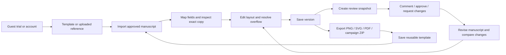

# Forma: end-to-end product documentation

**Current checkpoint:** [Project status](STATUS.md), reconciled October 4, 2026. Read this first for implemented scope, verification limits and release blockers. The new [Create with AI guide](create-with-ai.md) covers the cross-format beta flow. The [canvas action guide](editor-canvas-actions.md) records editing interactions, and the [codebase guide](codebase-guide.md) maps the source.

[Prioritized delivery checklist](TODO.md) is the source of truth for remaining production work. [Feature delivery log](PROGRESS.md) records completed changes, verification and external dependencies.

[Expanded product direction](product-expansion.md) defines graphics, editorial/document and presentation families. Stages 1–5 have local implementation foundations, with hosted team access, output-fidelity checks and external skill adapters still incomplete. Visual redesign follows the [Studio Ink playbook](design-playbook.md) and latest [Editorial workbench direction](frontend-overhaul-2026-10-03.md); see [interface audit](interface-audit.md) and [verification report](redesign-verification.md). Stage 6 public production remains open.

The [agency use-case assessment](agency-use-cases-2026-10-04.md) compares Forma with a Claude Team reporting-system brief and prioritizes adjacent agency workflows. It distinguishes local prototypes from customer-ready delivery.

The [AI-first design direction](ai-first-design-direction.md) is the primary product hypothesis: new editable concepts from approved copy, reference and brand, with exact-copy checks. The implemented three-direction planner is an early step; production-ready autonomous design remains unproven.

The [template and reference workflow](template-to-design-workflow.md) specifies agency-owned template upload, PDF preparation, adaptable layouts, simple generation choices and exact-copy review. It is a forward-looking specification, not an implemented feature claim.

**Release:** 0.2.0 private-beta implementation. **Hosted target:** Vercel + Supabase with Gemini for creation and optional OpenAI analysis. **Business model:** Free + configurable Pro via Paystack; checkout stays closed until configured and verified.

See [production readiness](production-readiness.md) for the remaining public-launch work and [billing setup](billing.md) for Paystack integration.

## Read by role

| Reader | Start here |
|---|---|
| Product owner | [Purpose, scope, acceptance criteria, and deferred work](product.md) |
| Designer or business owner | [Complete user guide](user-guide.md) |
| Designer trying new directions | [Create with AI](create-with-ai.md) |
| Frontend/backend developer | [Codebase guide](codebase-guide.md), [architecture and data model](architecture.md), [API contracts](api.md) |
| Designer checking fonts and Elements | [Typography and asset browsing](typography-and-assets.md) |
| Designer using the canvas | [Canvas actions, palettes, layers and frames](editor-canvas-actions.md) |
| Operator deploying the beta | [Deployment, configuration, backups, and recovery](deployment.md) |
| Reviewer handling user data | [Privacy and security boundaries](privacy-security.md) |
| Release owner | [Tests and hosted release gates](testing-release.md), [verification record](verification.md) |

## Complete product journey

## Implemented release inventory

| Area | Behavior |
|---|---|
| Entry and identity | Guest editing; local development registration/login/logout/recovery; Supabase signup, email confirmation, reset, and sign-out integration; account deletion route. |
| Workspace | Project dashboard with previews, search, sorting and direct opening; library/canvas/inspector; direct text editing, closeable Layers, page/object context actions, brand palettes, crop-to-fill frames, geometry, font/color/alignment, locks, undo/redo, zoom and template sizes. |
| Inputs | PNG/JPEG/WebP references; TXT/Markdown/DOCX/text-based PDF manuscripts; editable Forma JSON projects. |
| References | Manual region drawing; actual local OCR; configured OpenAI structured analysis; candidate-region review; font/color estimates; solid-color text covers. |
| Copy contract | Deterministic field mapping, unchanged wording, revision comparison including removals, no generated copy, bounded auto-fitting, unmapped/overflow export gates. |
| Persistence | Browser guest projects; account-backed versioned projects; ownership checks; optimistic concurrency and visible conflict resolution; reusable templates; project deletion. |
| Brand | Versioned brand systems (text/background/accent, up to 12 additional colors, display/body fonts); exact-match color replacement, explicit apply with `brandRef` pin; legacy two-color payloads still readable. |
| Design systems | Declarative components, versioned templates (`templateRef`), Skills library with Event Campaign skill, exact-copy apply, package export/import, explicit skill upgrades. |
| Billing | Optional Paystack Free + Pro checkout, verified access, management links, recent payment history, monthly analysis allowances; closed until configured. |
| Review | Expiring immutable snapshots; optional signed-in approvals with recorded identity; legacy self-reported names still available; comments; revocation. |
| Output | Real PNG/SVG, flattened PDF, portable JSON, and ZIP with three rendered aspect ratios and original approved manuscript. Multi-page documents export multi-page PDF or editable JSON. |
| Documents | Multi-page flowing layout with masters, page numbers, tables (header repeat), citations, repagination, and 1/10/20-page fixtures. |
| Presentations | 16:9 slides, chart layouts, speaker notes, PDF + editable PPTX adapters with fidelity limits. |
| Team | Local-mode workspaces with roles, cross-workspace denial, pinned publications, audit log and membership recovery. Hosted Supabase team RLS not yet shipped. |
| Operations | Vercel configuration, SQL migration/RLS/RPCs, environment example, local scripts, CI workflow, tests, backup/restore and activation runbook. |

## What “complete” means here

The locally runnable beta covers the product journey above. It is not a claim that arbitrary references can be recreated pixel-perfectly or that external accounts have been provisioned. Production activation requires your Supabase project, Vercel deployment, OpenAI credentials/model access, and hosted verification. The [release gates](testing-release.md) list those separately.

This release supports graphics and multi-page documents, up to 50 additional text layers and 30 image/shape elements with stacking controls, plus local team workspaces. It does not include realtime co-editing, exact font recovery, textured-background inpainting, unlimited layers, AI-written copy, or hosted team RLS. Extending those is product work, not a hidden configuration switch.

## Source-of-truth rules

- `src/domain/design/schema.ts` defines the editable project contract; `manuscript.ts` owns exact-copy parsing and application, with a compatibility export from `model.ts`.
- `server/app.ts` and `server/store.ts` define HTTP and persistence behavior.
- `supabase/migrations/202609240001_forma.sql` defines production database permissions and atomic operations.
- `server/analysis/index.mjs` defines provider requests and strict output validation.
- `tests/` verifies the local acceptance paths; [verification.md](verification.md) records what was executed.
- Documentation must be updated whenever a capability, limit, field, or deployment requirement changes.
