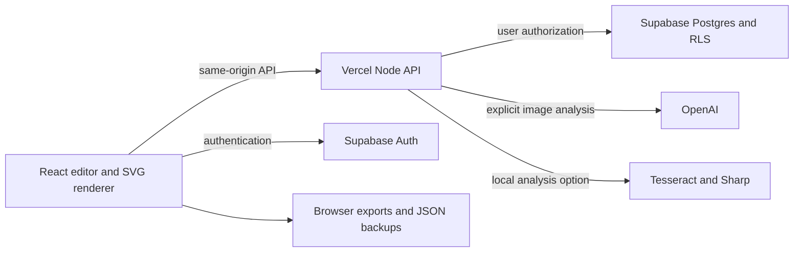

# Architecture and data model

This document describes the implemented architecture. See the [codebase guide](codebase-guide.md) for source ownership and development conventions. Stages 1–5 of the expansion track are in product code: graphics foundation, design systems, multi-page documents (`src/domain/design/flowDocument.ts`), team operations (`src/domain/team/teamOps.ts`, local account APIs), and presentations (`src/domain/design/presentation.ts`). Guest storage and editable files use the versioned `forma-design` envelope by default; the live graphics editor edits through a legacy `Project` projection, and document/presentation projects store additional layout on that projection.

## System boundaries

Local development replaces Supabase persistence/authentication with SQLite and cookie sessions. This is an explicit adapter, not an offline simulation of hosted Supabase. Vercel production must use Supabase mode because function filesystems are not durable application databases.

The frontend owns interactive layout, manuscript parsing, fitting, and export. The API owns authentication enforcement, project versions, revision/review persistence, and privileged provider calls. Supabase owns production identities and durable records. OpenAI is an optional reference-analysis provider; the manuscript stays outside its generation path.

## Customer routes and project selection

The application lazily loads public pages, authentication, onboarding, `/dashboard`, `/account`, `/editor`, and snapshot-review routes. `Dashboard.tsx` reads the existing owner-scoped project API for accounts and local storage for guests. It never merges the two lists implicitly. Search/sorting currently operate on the fetched list; server pagination and separate image storage remain planned.

Dashboard template/reference actions write an owner-bound session intent consumed by the editor after persistence initialization. `/editor?project=<id>` selects only a project in the current owner’s returned list. A missing ID leaves persistence unready, preventing autosaving a replacement. Navigation from the editor waits for saving and refuses to discard an unapplied manuscript. Initial loading prevents guest edits being overwritten by asynchronous initialization; subsequent account transitions retain the mounted recovery-code dialog.

## Project document

Page size: `format` may be `portrait`, `square`, `story`, `banner` or `custom`. Named presets resolve through `formatPresets`; `custom` requires a validated `pageSize` between 360 and 2400 on each axis. `canvasWidth` / `canvasHeight` / `resolvePageSize` drive the SVG viewBox, exports and versioned page dimensions. Editable layouts remain in a fixed 720×900 design space and scale to the page on both axes. Reference mode keeps a 720-wide canvas sized by `referenceHeight`. Legacy projects without `pageSize` remain valid.

Content blocks: optional `contentBlocks` stores the last applied manuscript as ordered `{id,label,text,fieldId?}` entries. `parseManuscriptBlocks` / `applyContentBlocks` map recognized labels into the six `copy` fields and bind free blocks to managed `layer-block-*` text layers. Unknown labels without a preceding blank line remain inside the active section so wording such as `Tickets: $25` is not split. Versioned file `content` prefers these blocks when present.

Design systems: `BrandSystem`, `VersionedTemplate`, `DesignComponent` and `SkillManifest` live in `src/domain/design/designSystem.ts`. Projects may pin `brandRef`, `templateRef` and `skillRef`. `/api/brand` stores versioned brand systems (legacy two-color payloads still read). `/api/templates` and `/api/skills` persist owner-scoped records; guests use localStorage mirrors. Applying a skill maps manuscript blocks, preserves exact copy, and never silently upgrades a pinned skill version.

Documents: when `family` is `document`, `flow` holds letter-size pages, master chrome, content blocks and elements (text frames and tables). `paginateDocument` places content without dropping blocks; table splits repeat headers; overflow frames are linked and flagged. Multi-page PDF export renders each page; versioned backups keep the full `flow` inside `compatibility.project`.

`Project.graphicLayers` adds validated image/shape objects (maximum 30) and `layerOrder` records the combined added-text/graphic stack. `layers.ts` shares validation and stack/movement rules; the renderer uses this order in every preview and output. Locked objects cannot be moved/reordered through the editor. Original artwork and original manuscript fields remain below this added stack.

Image upload accepts PNG/JPEG/WebP up to 5 MB and 16 megapixels, then normalizes into a maximum 960-pixel WebP. Each embedded data URL is bounded to 220,000 characters; combined image payload is limited to 500,000 characters. Images use centered crop-to-fill rendering without stretching; photo frames clip them to rectangle, rounded or ellipse masks. The editor does not yet support crop focal-point adjustment. Server project validation rejects external URLs, other media types, invalid geometry and duplicate layer IDs. These bounds do not replace the future private-storage migration; revisions still duplicate embedded assets.

Version-3 backups preserve graphics and layer order, projecting asset IDs without duplicating image bytes outside the compatibility snapshot. Versions 1 and 2 remain readable. This extension still uses the legacy renderer bridge rather than the final multi-page document runtime.

`Project.textLayers` is an optional, server-validated array of up to 50 independent text objects with stable IDs, wording and layout. Legacy projects omit it. The shared renderer includes these layers for editor, dashboard, snapshots and export; the export guard checks their text fit and bounds. Positions use the existing 720×900 normalized coordinate space and scale vertically for each format. Additional text is not regenerated by manuscript parsing. Layer order defaults to array order; the v3 ordering extension provides stacking controls among added elements.

Backups with text-only layers and no explicit stack order can use `schemaVersion: 2`; the reader still accepts v1 and unversioned legacy files. V2 includes their source blocks and projected elements plus the compatibility snapshot. Full arbitrary-element runtime migration remains pending.

### Versioned editable files (October 1)

`src/domain/design/document.ts` defines the versioned `forma-design` portability envelope. `src/domain/design/documentRuntime.ts` makes that envelope the default guest-storage authority behind a feature flag: browser saves write documents; loads accept documents or legacy Project JSON. Opening always returns an independent legacy `Project` for the live editor, persistence API payloads, previews, reviews and exports. `compatibility.project` remains the lossless snapshot. Unsupported versions or independent document edits are rejected. This is storage/portability authority, not a completed replacement of the interactive renderer. Database snapshots and historical reviews are unchanged.

`src/domain/design/schema.ts` defines the canonical `Project`; `manuscript.ts` owns exact-copy parsing/application, while `model.ts` keeps defaults/fitting and compatibility exports. It stores ID/name, selected template, six copy strings, original applied manuscript, six layout rectangles, reference image/name/height, template/reference mode, mapped fields, cover colors, locks, format, and update time. Each rectangle uses a 720-unit-wide coordinate system, typography size, alignment, color, and position lock.

Reference images are embedded data URLs in the JSON snapshot, not separate Supabase Storage objects. Consequently revisions and review snapshots can duplicate image data; retention and database growth must be monitored. Portable project files may contain the full manuscript and embedded reference.

Persistent project version numbers are separate from the document's `updatedAt`. Saves include `expectedVersion`; the data adapter accepts only a matching current version and returns the new version. This prevents silent concurrent overwrites. Revisions store previous/current snapshots according to the adapter implementation. Reviews freeze a project snapshot and carry expiry, status, and comments.

## Rendering and analysis

SVG renders editable text and built-in artwork. Browser measurements drive word wrapping and fitting. Fitting shrinks within a bounded range and reports unresolved overflow. Original fonts are not recovered; supported fallback fonts have predictable measurement. Text checks do not detect every overlap or aesthetic problem.

Analysis accepts a bounded raster input and returns candidate normalized rectangles, OCR text, confidence/style hints, and suggested semantic fields. The user approves field mappings; approved manuscript strings populate fields deterministically. No proposed OCR text should replace the manuscript.

## Failure behavior

Invalid projects are rejected before persistence. Version mismatch is a 409 conflict. Missing server/provider configuration is a visible unavailable state. Provider errors must not expose keys, stack traces, or user content. A browser save and a cloud save are different states and should be labeled accordingly. The save indicator compares the current project snapshot with the last persisted snapshot for both adapters, so an older successful save cannot label newer edits as saved. Review token access is intentionally public capability access, never owner access.

## Source map

- `src/domain/design/schema.ts`, `manuscript.ts`, `model.ts`: schema, parser, defaults and fitting.
- `src/domain/design/designSystem.ts`: brand systems, components, versioned templates, skills.
- `src/domain/design/flowDocument.ts`: multi-page document pagination, tables, masters.
- `src/domain/design/presentation.ts`: slide decks, charts, PPTX/PDF adapters.
- `src/domain/team/teamOps.ts`: workspaces, roles, publications, audit helpers.
- `src/features/editor/panels/DocumentPanel.tsx` / `src/features/editor/canvas/DocumentCanvas.tsx`: document UI and page rendering.
- `src/features/editor/panels/PresentationPanel.tsx` / `src/features/editor/canvas/PresentationCanvas.tsx`: slide UI and rendering.
- `src/features/team/TeamPanel.tsx`: workspace invite, publish and audit UI.
- `src/features/editor/components/Poster.tsx`: SVG design renderer and interactive geometry.
- `src/features/editor/EditorPage.tsx`: workspace and workflow orchestration.
- `src/features/workflows/SkillsPanel.tsx`: skill library, preview, apply and package IO.
- `server/`: API, auth, local/Supabase adapters.
- `server/analysis/`: OCR and OpenAI proposal generation.
- `api/index.ts`: Vercel entry point.
- `supabase/`: production database migration.
- `tests/`: automated regression coverage.
