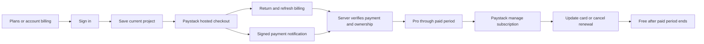

# Paystack subscriptions

Forma has Free and Pro plan flows. Pro currently adds a larger monthly reference-analysis allowance. Saving, manual design editing, existing projects, exports and reviews remain available on Free. Price/currency/interval come from a configured Paystack plan; the app does not invent a price or accept one from the browser.

## User journey

The Plans button is in the editor navigation; signed-in users also have Plans and billing in their account dialog. Checkout redirects are not proof of payment. Refresh billing verifies the returned reference on the server, including account binding, successful status, plan, amount, currency, and test/live domain. Signed webhook `charge.success` events use the same verifier.

## Configuration and activation

1. Apply both Supabase migrations in order. The second creates private `forma_billing` state and a service-role-only compare-and-swap function. The browser cannot read or change it through Supabase.
2. Set `SUPABASE_SERVICE_ROLE_KEY` on the server for cloud billing. Do not prefix secrets with `VITE_`.
3. In a Paystack test account, create one Pro plan with monthly or annual recurrence. Select the price and currency there. Use a new plan code for price changes; automated plan migration/proration is not implemented.
4. Set `PAYSTACK_SECRET_KEY=sk_test_...`, `PAYSTACK_PRO_PLAN_CODE=PLN_...`, `APP_ORIGIN`, and `FORMA_BILLING_ENABLED=true`. Bad or incomplete enabled configuration stops server startup. Live keys require an HTTPS origin.
5. Configure the publicly reachable Paystack webhook as `https://YOUR-DOMAIN/api/billing/webhook`. A plain localhost URL cannot receive Paystack events. Configure test and live environments separately.
6. Draft allowance defaults are `FORMA_FREE_ANALYSES_PER_MONTH=5` and `FORMA_PRO_ANALYSES_PER_MONTH=100`. They are configurable, not a pricing recommendation. They apply only when billing is enabled. Quotas reset by UTC calendar month, including annual subscriptions; they do not roll over. Started attempts count, including provider failures. Existing hourly anti-abuse limits still apply.
7. Complete the test checklist below before setting live credentials. With billing disabled, no upgrade checkout is offered and the existing beta analysis limits apply.

The implementation uses card checkout for recurring billing. Paystack documents its supported subscription payment methods and lifecycle in [Subscriptions](https://paystack.com/docs/payments/subscriptions/). Merchant eligibility and available currencies must be checked for the actual business account.

## Access, lifecycle and failure behavior

- Payment references are applied once. Replays do not extend the subscription or undo a reversal. Paid access derives from the latest unrevoked verified payment's paid-through date, not a client flag or an unbounded `active` status.
- Billing periods are calculated from the verified paid date and configured plan interval. Monthly end-of-month handling follows the documented 28th-day convention. Verify actual renewal timing on the merchant's test plan before launch; there is no proration engine.
- Cancellation/non-renewal retains already-paid access. A failed renewal shows attention and cannot create another paid period. Updating a card does not imply that a failed charge was collected.
- Manage subscription requests a short-lived Paystack-hosted management link for the authenticated owner's verified subscription. Card data and provider authorization tokens are not stored by Forma.
- Pending checkout reservations prevent simultaneous requests from creating multiple payment pages. Reopening Plans resumes the saved checkout. If initialization succeeds at Paystack but its response is lost, the reference remains reserved and requires reconciliation/support; the system does not silently initiate a second charge.
- An existing non-terminal subscription blocks a second checkout. Downgrading does not remove project access. Account deletion requires renewal cancellation and checks the current provider subscription first; unresolved checkouts require support resolution.
- Signed processed-refund and dispute-created events put the corresponding payment's access on hold. Partial refunds also hold that payment in this initial policy. There is no automatic dispute-win restoration; an operator must verify and resolve it. Final commercial policy and operator procedures must be approved before live use.
- HTTP errors leave the caller in a recoverable state; provider errors do not expose credentials. Webhook processing failures return an error so Paystack can retry. No acknowledgement occurs before the applied operation finishes.

Raw webhook bytes are authenticated with HMAC-SHA512, using constant-time signature comparison as described in [Paystack webhooks](https://paystack.com/docs/payments/webhooks/). Payment confirmation uses the [verify transaction API](https://paystack.com/docs/payments/verify-payments/).

## Endpoints

| Endpoint | Access and behavior |
|---|---|
| `GET /api/billing/plans` | Public, configured price and draft allowances; no secrets. |
| `GET /api/billing` | Signed-in owner's access, usage, recent payment history and pending reference. |
| `POST /api/billing/checkout` | Signed in, CSRF in local mode. Creates/resumes a server-owned reference; ignores browser price/plan input. |
| `POST /api/billing/verify` | Signed in, body `{reference}`. Verifies server-to-server and checks ownership. |
| `POST /api/billing/refresh` | Signed in. Reads current subscription lifecycle state. Does not grant access merely because a subscription is active. |
| `POST /api/billing/manage` | Signed in. Returns the owner's hosted payment-card/cancellation page URL. |
| `POST /api/billing/webhook` | Public raw JSON route; valid Paystack signature required. No browser session required. |

Cloud writes use versioned compare-and-swap retries, including quota increments, so concurrent requests do not lose billing changes or overspend allowances. Local SQLite implements the same state operations. No scheduled automatic reconciliation or background webhook queue is installed; these are operational work before a public paid launch.

## Verification and release gates

Automated tests use a real local HTTP server/SQLite and mocked Paystack API responses. They cover checkout binding, mismatched/failed payments, duplicate events, cancellation, failed renewals, reversals, replay safety, ownership, deletion protection, quota enforcement, and signatures. Embedded PostgreSQL checks deny billing access to anonymous/authenticated client roles and verify service-role atomic writes.

Still required in a real Paystack test environment:

- [ ] Real checkout success, abandonment, failed card, refresh, and return after sign-in expiry.
- [ ] Signed notification delivery/retry, reordered events, lost initialize response and support recovery.
- [ ] Automatic renewal, attention/failed renewal, card update, cancel/expiry, and resubscribe after expiry.
- [ ] Refund/dispute events with actual provider payload shapes and approved business policy.
- [ ] Staging Supabase service-role permissions and concurrent usage enforcement.
- [ ] Confirm amount/currency/interval displayed match hosted checkout and payment history.
- [ ] Alerting for failed webhooks and support/reconciliation procedure; accounting retention beyond account deletion if required.
- [ ] Live merchant activation, final prices/limits, approved billing terms, and one authorized live smoke test.

No Paystack account, plan, real transaction, live notification, or live subscription was created by the local implementation work.
